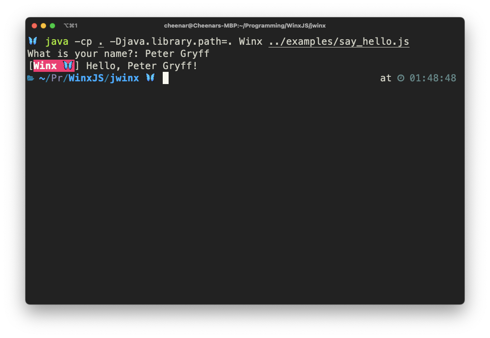

# Overview



Enables basic interopability with Java. I have exported the monolithic `main()` function in order to invoke winx directly from Java-land. Supports passing in basic CLI argument (file) as a java-arg. 

Now that there is some basic Java interop, need to either focus on Java callback support (and building the runtime one stack higher in the Java-level), or supporting a thin-wrapper to enter the native context. 

# How to Build

**Prepare the header file**

```
javac -h . Winx.java
```

**Build the library objects**

```
g++ -c -fPIC -I${JAVA_HOME}/include -I${JAVA_HOME}/include/darwin Winx.cc -std=c++17 -O3 -Wall -pedantic -I./../include/toml++ -I./../include/v8 -I./../include/uv -I./../include -o Winx.o 
```

**Create dynamic library**

```
g++ -dynamiclib -o libwinx.dylib Winx.o  ../obj/winx_config.o  ../obj/winx_modules.o ../obj/winx_globals.o  ../obj/winx_util.o ./../lib/v8/libv8_monolith.a ../lib/libuv/libuv.a -shared-libasan -lc
```

**Run the java**

```
java -cp jwinx -Djava.library.path=jwinx/ Winx examples/bundle.js
```